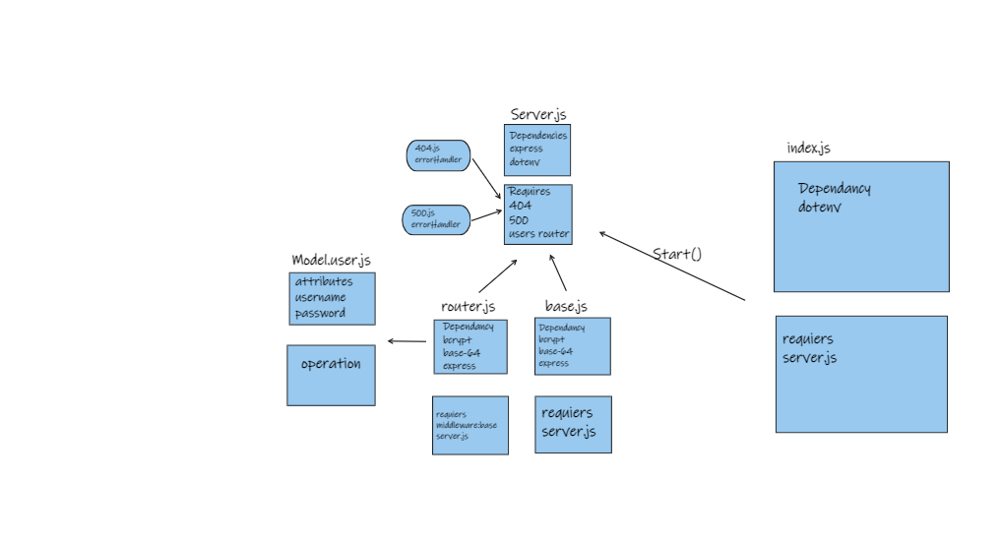
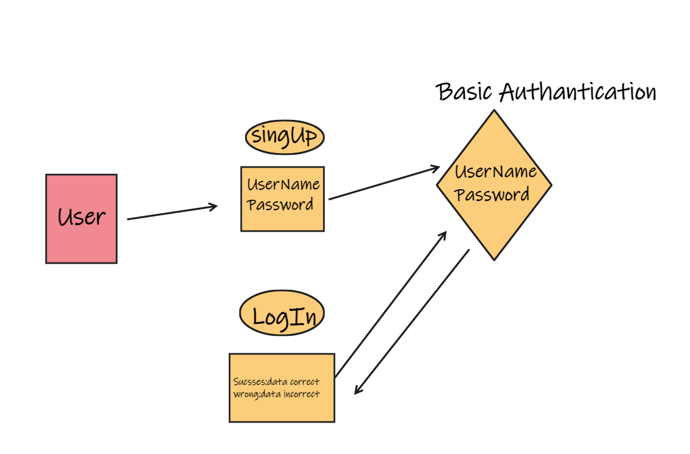

# basic-auth:

Authentication System: Deploy an Express server that implements Basic Authentication, with signup and signin capabilities, using a Postgres database for storage.

 

[Pull Request](https://github.com/ebnanzhran/bacic-auth/pull/1)
[heroku link](https://basic-auth-tasneem.herokuapp.com/users)

